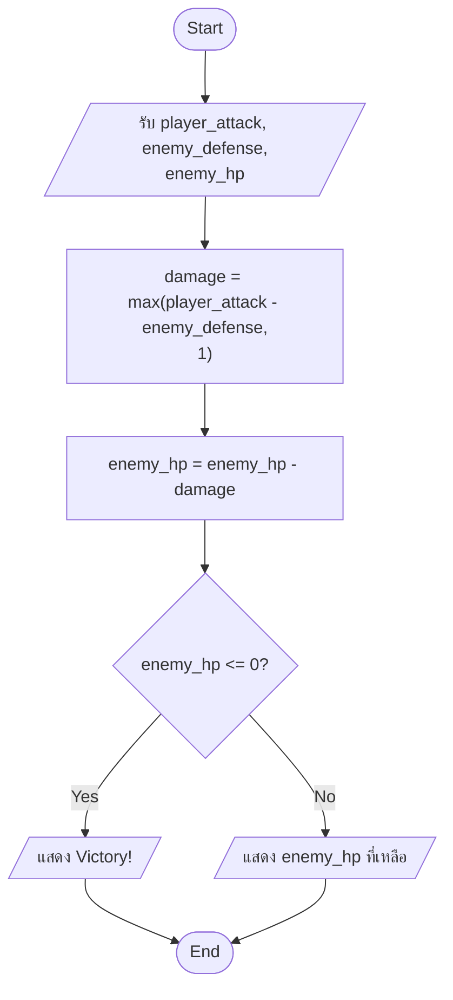
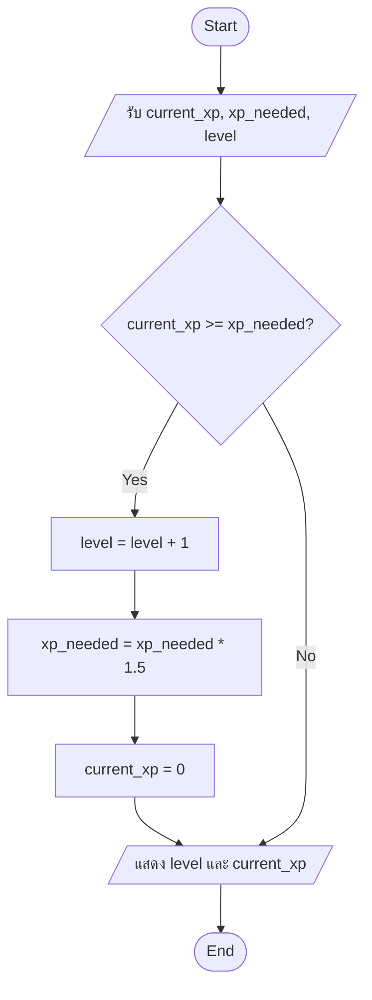
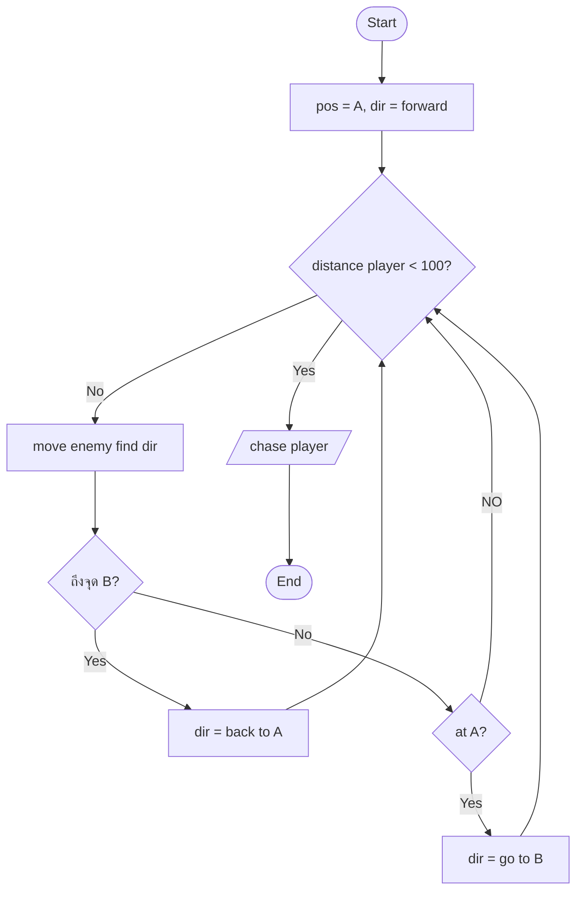

```mermaid
flowchart TD
Start([Start]) --> Input[/รับ player_attack, enemy_defense,
enemy_hp/]
Input --> Calc["damage = max(player_attack - enemy_defense,
1)"]
Calc --> Reduce["enemy_hp = enemy_hp - damage"]
Reduce --> D1{enemy_hp <= 0?}
D1 -->|Yes| Win[/แสดง Victory!/]
D1 -->|No| Show[/แสดง enemy_hp ที่เหลือ/]
Win & Show --> End([End])
```

```mermaid
flowchart TD
Start([Start]) --> Input[/รับ current_xp, xp_needed, level/]
Input --> D1{current_xp >= xp_needed?}
D1 --> |Yes| output[level = level + 1]
output --> output3[xp_needed = xp_needed * 1.5]
output3 --> output4[current_xp = 0]
output4 --> output2
D1 --> |No| output2[/แสดง level และ current_xp/] 
output2 --> End([End])

```

```mermaid
flowchart TD
Start([Start]) --> Input[pos = A, dir = forward]
Input --> D1{distance player < 100?}
D1 --> |Yes| output1[/chase player/]
D1 --> |No| output2[move enemy find dir]
output2 --> D2{ถึงจุด B?}
D2 --> |Yes| output3[dir = back to A]
output3 -->D1
D2 --> |No| output4{at A?}
output4 --> |NO |D1
output4 --> |Yes| output5[dir = go to B]
output5 --> D1
output1 --> End([End])
```
